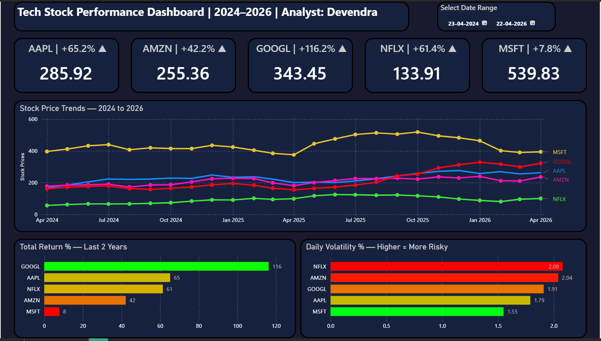

# 📈 Stock Market EDA + Dashboard
   

## 🎯 Project Overview
An investment research analysis of **5 major tech stocks** over 2 years using real live data. This project answers the key question every investor asks:

> *"Which stock gave the best returns? Which is most risky? And what trends should an investor watch?"*

Unlike most projects that use downloaded CSV files, this project pulls **real-time live data** directly from Yahoo Finance using the `yfinance` library — the same tool used by financial analysts in the industry.

---

## 📁 Project Structure
```
Stock_Market_Project/
│
├── Stock_Market_EDA.ipynb            # Main analysis notebook
├── stock_data_for_powerbi.csv        # Processed data for dashboard
├── Stock_Market_Dashboard.pbix       # Power BI dashboard file
├── Stock_Dashboard.pdf               # Exported dashboard PDF
│
├── charts/
│   ├── chart1_price_trends.png
│   ├── chart2_normalized.png
│   ├── chart3_total_return.png
│   ├── chart4_volatility.png
│   ├── chart5_moving_average.png
│   ├── chart6_correlation.png
│   └── dashboard_screenshot.png
│
└── README.md
```

---

## 🛠️ Tools & Technologies
| Tool | Purpose |
|------|---------|
| Python 3 | Core programming language |
| yfinance | Live stock data from Yahoo Finance |
| Pandas | Data manipulation & analysis |
| Seaborn & Matplotlib | Data visualization |
| Power BI | Interactive business dashboard |
| Jupyter Notebook | Development environment |

---

## 📦 Dataset
- **Source:** Live data via `yfinance` (Yahoo Finance API)
- **Stocks Analyzed:** AAPL, AMZN, GOOGL, MSFT, NFLX
- **Period:** April 2024 – April 2026 (2 Years)
- **Size:** 501 trading days per stock

---

## 🔄 Project Workflow
```
Phase 1 → Live Data Download via yfinance
          ↓
Phase 2 → Data Cleaning & Exploration
          (Verified 0 missing values, extracted Close prices)
          ↓
Phase 3 → EDA + Visualizations
          (6 charts — price trends, returns, volatility, moving averages, correlation)
          ↓
Phase 4 → Power BI Dashboard
          (5 KPI cards, line chart, 2 bar charts, date slicer)
          ↓
Phase 5 → Business Insights & Recommendations
```

---

## 🔍 Key Findings

### Stock Performance Summary
| Stock | Current Price | Total Return (2Y) | Daily Volatility | Risk Level |
|-------|-------------|------------------|-----------------|-----------|
| GOOGL | $339 | **+116.2%** 🏆 | 1.91% | Medium |
| AAPL | $273 | +65.2% | 1.79% | Low-Medium |
| NFLX | $93 | +61.4% | **2.08%** ⚠️ | Highest |
| AMZN | $255 | +42.2% | 2.04% | High |
| MSFT | $432 | +7.8% | **1.55%** 🛡️ | Lowest |

### Finding 1 — Best Performing Stock
- **GOOGL delivered 116.2% return** over 2 years
- $1,00,000 invested in GOOGL in April 2024 = ~$2,16,200 today
- GOOGL was flat for 12 months then surged dramatically from mid-2025

### Finding 2 — Worst Performing Stock
- **MSFT returned only 7.8%** despite being the highest priced stock at $432
- Proves that high stock price does NOT mean high returns

### Finding 3 — Risk vs Return Analysis
- NFLX = Highest risk (2.08% daily volatility) with 61.4% return
- MSFT = Lowest risk (1.55%) but worst return (7.8%)
- **GOOGL = Best risk-adjusted performance** — medium risk, highest return

### Finding 4 — Correlation Analysis
- AAPL and GOOGL move very closely together (0.82 correlation)
- MSFT moves independently from AAPL (only 0.24 correlation)
- Combining AAPL + MSFT in a portfolio reduces overall risk through diversification

### Finding 5 — Moving Average Trends
- GOOGL's 30-day MA showed clear upward momentum from late 2025
- MSFT peaked at ~$539 in late 2025 then declined sharply
- NFLX showed the most erratic movement — consistent with highest volatility

---

## 💡 Investment Recommendations

| Investor Type | Recommended Stock | Reason |
|--------------|------------------|--------|
| Growth Investor | **GOOGL** | Best 2-year return at 116.2% |
| Conservative Investor | **MSFT** | Lowest volatility at 1.55% |
| Balanced Portfolio | **AAPL + MSFT** | Low correlation (0.24) = good diversification |
| Avoid (High Risk) | **NFLX** | Highest volatility, unpredictable movement |

---

## 📊 Dashboard Preview


### Dashboard Features
- 5 KPI cards showing current price + 2-year return %
- Interactive line chart with date range slicer
- Total Return % ranking bar chart
- Daily Volatility risk comparison bar chart

---

## ▶️ How to Run This Project

1. Clone this repository
```bash
git clone https://github.com/Devendra0602/stock-market-eda.git
cd stock-market-eda
```

2. Install required libraries
```bash
pip install yfinance pandas numpy matplotlib seaborn
```

3. Open the notebook
```bash
jupyter notebook Stock_Market_EDA.ipynb
```

4. Run all cells — data downloads live automatically

5. Open `Stock_Market_Dashboard.pbix` in Power BI Desktop to view dashboard

---

## 👤 Author
**Devendra**
- 📧 [patil.devendra062@gmail.com]
- 💼 [https://www.linkedin.com/in/patil-devendra2701/]
- 🐙 [https://github.com/Devendra0602]


---

## 📌 Resume Line for This Project
> *"Analyzed 2 years of live stock data for 5 tech companies using Python & yfinance — identified GOOGL as best performer with 116.2% return and built an interactive Power BI dashboard with KPI cards, trend analysis and volatility comparison"*
